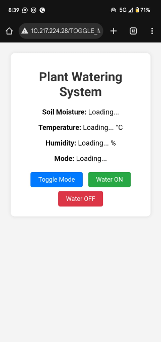

# AI-Plant-Watering-Device
AI-Based Predictive Watering System is transforming the agricultural sector by bringing in smart, automated irrigation. Conventional practices result in wastage of water unnecessarily, inefficient water delivery to the crops, and lengthy processes.
##  System Architecture

##  How It Works
1. Sensors collect soil moisture data  
2. Data is processed using AI model  
3. System predicts watering needs  
4. Water pump is automatically controlled  

##  Features
- Automated irrigation system  
- AI-based prediction  
- Water conservation  
- Real-time monitoring  
## Demo

